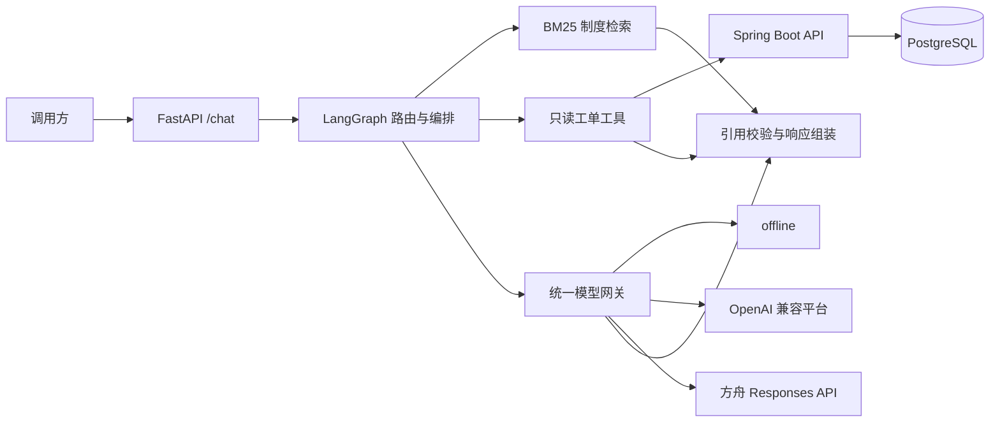

# Enterprise Work Order AI Assistant

面向企业工单场景的可审计 RAG + Agent MVP：以 Spring Boot 提供只读工单能力，以 FastAPI、LangGraph 和 BM25 完成意图路由、制度检索、工具调用及有依据的回答，并通过统一网关兼容多个国内大模型平台。

> 仓库中的制度、项目、人员和 50 条工单均为合成数据，不对应任何真实企业、客户或生产系统。

## 一眼看懂

| 能力 | 实现 | 可验证结果 |
| --- | --- | --- |
| 企业后端 | Java 17、Spring Boot、MyBatis-Plus、Flyway、PostgreSQL | 详情、条件分页、返工链路 3 类只读接口 |
| RAG | Markdown 制度切分、jieba、BM25、原文引用 | 20 个需检索案例 Recall@5 为 100% |
| Agent | LangGraph 三路编排、Java 工具调用、调用审计 | 工具准确率 100% |
| 模型接入 | 离线模板、OpenAI 兼容适配器、方舟 Responses 适配器 | 7 个在线 provider 配置；两类协议适配器通过 MockTransport 契约测试 |
| 工程化 | Docker Compose、Testcontainers、pytest、CI | 30/30 请求成功，引用有效率 100% |

以上评测结果于 2026-07-18 在默认 `offline` 模式下通过本仓库脚本实测。在线平台只做了无密钥的 HTTP 契约测试，未把 Mock 测试描述为真实模型联调。

## 快速启动

前置条件：Docker Desktop 或 Docker Engine，且支持 Docker Compose v2。首次构建需要下载 Java、Python 和 PostgreSQL 基础镜像，建议为 Docker 分配至少 2 GB 内存。

```bash
git clone <your-repository-url>
cd enterprise-work-order-ai-assistant
docker compose up --build -d
```

检查服务：

```bash
curl http://127.0.0.1:8080/actuator/health
curl http://127.0.0.1:8000/health
```

默认无需 API Key。启动后可访问：

- AI API 文档：<http://127.0.0.1:8000/docs>
- Java 健康检查：<http://127.0.0.1:8080/actuator/health>

停止并删除演示数据卷：

```bash
docker compose down --volumes
```

## 三个可复制演示

### 1. 制度问答：只检索，不查工单

```bash
curl -s http://127.0.0.1:8000/chat \
  -H "Content-Type: application/json" \
  -d '{"session_id":"demo-k","message":"再次返工时应该怎样关联根工单？"}'
```

预期：`tool_calls` 为空，`citations` 包含 `rework-policy` 及可在制度文件中逐字定位的 `quote`。

### 2. 工单查询：事实来自 Java 接口

```bash
curl -s http://127.0.0.1:8000/chat \
  -H "Content-Type: application/json" \
  -d '{"session_id":"demo-w","message":"查询 WO-20260718-001 当前状态"}'
```

预期：调用 `get_work_order`，返回状态、优先级、负责人和截止时间；不产生制度引用。

### 3. 组合问答：返工链路 + 制度解释

```bash
curl -s http://127.0.0.1:8000/chat \
  -H "Content-Type: application/json" \
  -d '{"session_id":"demo-c","message":"WO-20260718-008 为什么是返工单，接下来怎么处理？"}'
```

预期：调用 `get_rework_chain`，回答同时包含根工单 `WO-20260718-007`、返工单 `WO-20260718-008` 和返工制度引用。

Windows PowerShell 中请使用 `curl.exe`，或直接在 FastAPI `/docs` 页面执行请求。

## 架构



LangGraph 有三条显式路径：

```text
knowledge  -> retrieve_knowledge -> compose_answer
work_order -> call_work_order_tool -> compose_answer
combined   -> call_work_order_tool -> retrieve_knowledge -> compose_answer
```

工单事实由 Java 返回值确定性格式化；模型只负责解释检索到的制度片段。引用和工具审计记录由程序生成，不接受模型自行声明。完整设计见 [架构说明](docs/architecture.md)。

## `/chat` 响应契约

```json
{
  "answer": "...",
  "citations": [
    {
      "document_id": "rework-policy",
      "title": "返工处理规则",
      "section": "3.2 返工链路",
      "quote": "..."
    }
  ],
  "tool_calls": [
    {
      "name": "get_rework_chain",
      "arguments": {"work_order_no": "WO-20260718-008"},
      "status": "success"
    }
  ],
  "latency_ms": 42,
  "model": {
    "provider": "offline",
    "name": "deterministic-template",
    "fallback": false,
    "error_code": null
  },
  "warnings": []
}
```

## 评测与测试

启动 Compose 后运行：

```bash
python scripts/smoke_test.py
python eval/run_eval.py --base-url http://localhost:8000 --output eval/report.json
```

评测集严格包含 10 个制度问答、10 个工单查询和 10 个组合问答。验收门槛与本次结果：

| 指标 | 门槛 | 本次结果 |
| --- | ---: | ---: |
| 成功请求率 | 100% | 100%（30/30） |
| Retrieval Recall@5 | ≥ 80% | 100% |
| 引用有效率 | ≥ 90% | 100% |
| 工具准确率 | 100% | 100% |
| 必需事实准确率 | 观察指标 | 100% |
| 禁用事实准确率 | 观察指标 | 100% |

本地开发检查：

```powershell
$env:JAVA_HOME='C:\Program Files\Zulu\zulu-17'
cd apps/work-order-service
.\mvnw.cmd test

cd ../..
.\.venv\Scripts\python.exe -m pytest apps/ai-service/tests -q
.\.venv\Scripts\python.exe -m ruff check apps/ai-service/app apps/ai-service/tests eval scripts
.\.venv\Scripts\python.exe -m mypy --config-file apps/ai-service/pyproject.toml apps/ai-service/app
```

## 国内模型平台

`LLM_PROVIDER` 支持：

- `offline`：默认，无密钥、确定性回答。
- `deepseek`、`bailian`、`zhipu`、`kimi`、`qianfan`：OpenAI Chat Completions 兼容适配器。
- `ark`：火山方舟 Responses API 专用适配器。
- `custom`：自定义 OpenAI 兼容网关。

在线平台配置示例、当前官方端点、回退行为和真实密钥验证边界见 [模型配置指南](docs/provider-configuration.md)。

## 技术取舍

- **BM25 先于向量库**：MVP 只有 12 个制度段落，BM25 可离线、可复现、无需额外服务；接口已隔离为 `PolicyIndex`，后续可并行引入 pgvector 和混合召回。
- **Java 持有业务事实**：AI 服务不直连业务表，只调用稳定的只读 DTO，避免把权限、分页和返工关系复制到 Agent 中。
- **确定性事实与生成式解释分离**：状态、时限、负责人和根工单永远不由模型生成，降低幻觉风险。
- **离线优先**：克隆仓库即可演示；在线模型不可用时可按配置降级，并在 `model.fallback` 和 `error_code` 中显式披露。
- **合成数据而非脱敏数据**：公开仓库不携带真实业务代码、聊天记录、公司路径或客户数据。

## 项目结构

```text
apps/work-order-service/  Spring Boot 只读工单服务
apps/ai-service/          FastAPI、LangGraph、RAG 与模型网关
knowledge/policies/       3 份合成制度、12 个可检索段落
eval/                     30 题评测集与评测器
scripts/                  端到端冒烟脚本
docs/                     架构、配置和演示说明
.github/workflows/        无真实密钥的持续集成
```

## 常见问题

- **首次 Java 镜像构建较慢**：基础镜像较大；项目内 `settings.xml` 已只针对容器构建配置阿里云 Maven 公共镜像，后续会复用 Docker 层。
- **Windows 上 `localhost` 请求很慢**：本项目端口绑定 IPv4，优先使用 `127.0.0.1`。评测器会自动把 `localhost` 规范化为 IPv4 回环地址。
- **端口被占用**：停止占用 `8000` 或 `8080` 的进程，或修改 Compose 端口映射。
- **在线平台失败但仍有回答**：查看返回中的 `model.fallback` 和 `model.error_code`；需要硬失败时设置 `LLM_FALLBACK_ENABLED=false`。
- **没有真实模型密钥**：保持 `LLM_PROVIDER=offline`，全部核心演示与评测仍可运行。

## 文档

- [架构与可信边界](docs/architecture.md)
- [国内模型配置指南](docs/provider-configuration.md)
- [3 分钟演示脚本](docs/demo-script.md)
- [MVP 设计规格](docs/superpowers/specs/2026-07-18-enterprise-work-order-ai-assistant-mvp-design.md)

## License

[MIT](LICENSE)
