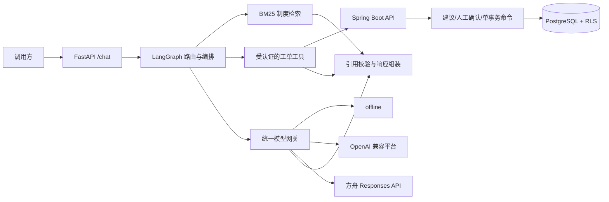

# Enterprise Work Order AI Assistant

面向企业工单场景的可审计 RAG + Agent MVP：Spring Boot 提供 JWT 认证、租户/项目隔离的工单查询，以及“建议—人工确认—事实写入”的命令能力；FastAPI、LangGraph 和 BM25 完成意图路由、制度检索、工具调用及有依据的回答。

> 仓库中的制度、项目、人员和 50 条工单均为合成数据，不对应任何真实企业、客户或生产系统。

## 一眼看懂

| 能力 | 实现 | 可验证结果 |
| --- | --- | --- |
| 企业后端 | Java 17、Spring Security、MyBatis-Plus、Flyway、PostgreSQL RLS | 租户内查询、权威操作预览、人工确认、幂等写入与审计 Outbox |
| RAG | Markdown 制度切分、jieba、BM25、原文引用 | 20 个需检索案例 Recall@5 为 100% |
| Agent | LangGraph 三路编排、Java 工具调用、调用审计 | 工具准确率 100% |
| 模型接入 | 离线模板、OpenAI 兼容适配器、方舟 Responses 适配器 | 7 个在线 provider 配置；两类协议适配器通过 MockTransport 契约测试 |
| 工程化 | Docker Compose、Testcontainers、pytest、CI | Java/Python 可执行测试与 Docker 门控的真实 PostgreSQL 冒烟验收 |

RAG 的 30 题离线评测结果来自 2026-07-18 的既有实测。多租户命令阶段的 Java/Python 测试与 Docker 实测状态分开记录；没有 Docker 时不会把静态测试描述成 PostgreSQL/Compose 实测。在线平台只做无密钥 HTTP 契约测试，未把 Mock 测试描述为真实模型联调。

## 快速启动

前置条件：Docker Desktop 或 Docker Engine，且支持 Docker Compose v2。首次构建需要下载 Java、Python 和 PostgreSQL 基础镜像，建议为 Docker 分配至少 2 GB 内存。

```bash
git clone https://github.com/tang119238/enterprise-work-order-ai-assistant.git
cd enterprise-work-order-ai-assistant
docker compose up --build -d
```

检查服务：

```bash
curl http://127.0.0.1:8080/actuator/health
curl http://127.0.0.1:8000/health
```

默认无需 API Key。启动后可访问：

- AI API 文档：<http://127.0.0.1:8000/docs>
- Java 健康检查：<http://127.0.0.1:8080/actuator/health>

健康检查无需认证；所有 `/api/**` 与 `/internal/**` 都需要服务端可验证的 JWT。复制 `.env.example` 为 `.env` 后，只能填入短期、合成身份的测试 Token。JWT 的签名私钥必须留在测试签发器或 Secret Store 中，不能提交到仓库。完整声明、角色和本地签名配置见 [操作建议 API](docs/api/action-proposals.md)。

停止并删除演示数据卷：

```bash
docker compose down --volumes
```

## 三个可复制演示

### 1. 制度问答：只检索，不查工单

```bash
curl -s http://127.0.0.1:8000/chat \
  -H "Content-Type: application/json" \
  -d '{"session_id":"demo-k","message":"再次返工时应该怎样关联根工单？"}'
```

预期：`tool_calls` 为空，`citations` 包含 `rework-policy` 及可在制度文件中逐字定位的 `quote`。

### 2. 工单查询：事实来自已认证的 Java 接口

```powershell
$env:DISPATCHER_TOKEN='<short-lived-synthetic-jwt>'
curl.exe -s http://127.0.0.1:8080/api/work-orders/WO-20260718-001 `
  -H "Authorization: Bearer $env:DISPATCHER_TOKEN"
```

预期：只在 Token 的 `tenant_id`、`project_ids` 与数据库当前授权求交后仍包含该工单时，返回状态、项目、负责人和 `version`；范围外统一为 `404 WORK_ORDER_NOT_FOUND`。

### 3. 高风险写入：先预览，再由人确认

`POST /api/action-proposals` 只保存服务器根据当前数据库事实生成的预览，不修改 `work_order`。随后由有权的人调用精确的确认接口：

```http
POST /api/action-proposals/{proposal-id}/confirm
Authorization: Bearer <human-jwt>
Idempotency-Key: synthetic-demo-confirm-001
Content-Type: application/json

{"decision":"CONFIRM"}
```

确认端点只接受上面的精确请求体；拒绝端点只接受 `{"decision":"REJECT"}`。字段名、大小写、端点与 decision 不匹配，或增加任意未知字段，都返回 `422 INVALID_COMMAND`。完整 CREATE、CONFIRM、同键 replay 与 REJECT 可复制示例见 [操作建议 API](docs/api/action-proposals.md)。

Windows PowerShell 中请使用 `curl.exe`，或直接在 FastAPI `/docs` 页面执行请求。

## 架构



LangGraph 有三条显式路径：

```text
knowledge  -> retrieve_knowledge -> compose_answer
work_order -> call_work_order_tool -> compose_answer
combined   -> call_work_order_tool -> retrieve_knowledge -> compose_answer
```

工单事实和写入都由 Java 决定；模型或 `AI_SERVICE` 最多创建操作建议，不能确认或拒绝。引用、命令事件和 Outbox 由程序生成，不接受模型自行声明。完整设计见 [架构说明](docs/architecture.md)。

当前 Python `WorkOrderClient` 不签发也不转发服务 JWT；因此本阶段的认证读写验收直接调用 Java API。把 `/chat` 的工单工具重新接到受保护接口前，部署方必须增加明确的 Token 传递/交换，不能恢复匿名 Java 访问。

## `/chat` 响应契约

```json
{
  "answer": "...",
  "citations": [
    {
      "document_id": "rework-policy",
      "title": "返工处理规则",
      "section": "3.2 返工链路",
      "quote": "..."
    }
  ],
  "tool_calls": [
    {
      "name": "get_rework_chain",
      "arguments": {"work_order_no": "WO-20260718-008"},
      "status": "success"
    }
  ],
  "latency_ms": 42,
  "model": {
    "provider": "offline",
    "name": "deterministic-template",
    "fallback": false,
    "error_code": null
  },
  "warnings": []
}
```

## 评测与测试

已准备三枚短期合成 JWT、对应数据库成员/项目范围，并启动 Compose 后运行：

```bash
python scripts/smoke_test.py
python eval/run_eval.py --base-url http://localhost:8000 --output eval/report.json
```

冒烟脚本会硬失败于缺少 Token、错误声明、服务不可用或 Docker/数据库计数不可查；每次使用唯一 `SMOKE-<run-id>` 工单，验证 401、跨租户 404、认证读取、权威预览、`AI_SERVICE` 多角色确认仍为 403、人工确认只增加一个版本，以及同 `Idempotency-Key` replay 不重复事件/Outbox。它不会删除既有数据。

评测集严格包含 10 个制度问答、10 个工单查询和 10 个组合问答。验收门槛与本次结果：

| 指标 | 门槛 | 本次结果 |
| --- | ---: | ---: |
| 成功请求率 | 100% | 100%（30/30） |
| Retrieval Recall@5 | ≥ 80% | 100% |
| 引用有效率 | ≥ 90% | 100% |
| 工具准确率 | 100% | 100% |
| 必需事实准确率 | 观察指标 | 100% |
| 禁用事实准确率 | 观察指标 | 100% |

本地开发检查（使用已安装 Maven，不依赖 wrapper）：

```powershell
$env:JAVA_HOME='<path-to-jdk-17>'
mvn -f apps/work-order-service/pom.xml test
.\.venv\Scripts\python.exe -m pytest apps/ai-service/tests -q
.\.venv\Scripts\python.exe -m pytest scripts/tests -q
.\.venv\Scripts\python.exe -m py_compile scripts/smoke_test.py
.\.venv\Scripts\python.exe -m ruff check apps/ai-service/app apps/ai-service/tests eval scripts
.\.venv\Scripts\python.exe -m mypy --config-file apps/ai-service/pyproject.toml apps/ai-service/app
```

本阶段在 2026-07-18 的当前工作树验证结果：已安装 Maven 3.9.16 + Java 17 全量运行 168 个 Java 测试，145 通过、23 个 Docker/Testcontainers 用例明确跳过；Python 合并测试 46 个全部通过，smoke 脚本编译和 `scripts` Ruff 检查通过。Docker CLI/Compose 可用，但 Docker Engine 返回 `Server: null` 且 named pipe 不存在，因此这次没有运行 `docker compose up` 和 live smoke，也不声明 PostgreSQL/Compose 端到端通过。Docker 门控的精确跳过项记录在阶段报告中。

## 国内模型平台

`LLM_PROVIDER` 支持：

- `offline`：默认，无密钥、确定性回答。
- `deepseek`、`bailian`、`zhipu`、`kimi`、`qianfan`：OpenAI Chat Completions 兼容适配器。
- `ark`：火山方舟 Responses API 专用适配器。
- `custom`：自定义 OpenAI 兼容网关。

在线平台配置示例、当前官方端点、回退行为和真实密钥验证边界见 [模型配置指南](docs/provider-configuration.md)。

## 技术取舍

- **BM25 先于向量库**：MVP 只有 12 个制度段落，BM25 可离线、可复现、无需额外服务；接口已隔离为 `PolicyIndex`，后续可并行引入 pgvector 和混合召回。
- **Java 持有业务事实与写权限**：AI 服务不直连业务表。任何高风险动作先形成服务器权威预览，再由有权的人确认；`AI_SERVICE` 即使同时声明其他角色也不能确认。
- **确定性事实与生成式解释分离**：状态、时限、负责人和根工单永远不由模型生成，降低幻觉风险。
- **离线优先**：克隆仓库即可演示；在线模型不可用时可按配置降级，并在 `model.fallback` 和 `error_code` 中显式披露。
- **合成数据而非脱敏数据**：公开仓库不携带真实业务代码、聊天记录、公司路径或客户数据。

## 项目结构

```text
apps/work-order-service/  Spring Boot 多租户查询与人工确认命令服务
apps/ai-service/          FastAPI、LangGraph、RAG 与模型网关
knowledge/policies/       3 份合成制度、12 个可检索段落
eval/                     30 题评测集与评测器
scripts/                  端到端冒烟脚本
docs/                     架构、配置和演示说明
.github/workflows/        无真实密钥的持续集成
```

## 常见问题

- **首次 Java 镜像构建较慢**：基础镜像较大；项目内 `settings.xml` 已只针对容器构建配置阿里云 Maven 公共镜像，后续会复用 Docker 层。
- **Windows 上 `localhost` 请求很慢**：本项目端口绑定 IPv4，优先使用 `127.0.0.1`。评测器会自动把 `localhost` 规范化为 IPv4 回环地址。
- **端口被占用**：停止占用 `8000` 或 `8080` 的进程，或修改 Compose 端口映射。
- **在线平台失败但仍有回答**：查看返回中的 `model.fallback` 和 `model.error_code`；需要硬失败时设置 `LLM_FALLBACK_ENABLED=false`。
- **没有真实模型密钥**：保持 `LLM_PROVIDER=offline`，全部核心演示与评测仍可运行。

## 文档

- [架构与可信边界](docs/architecture.md)
- [操作建议 API、JWT、角色、错误与幂等](docs/api/action-proposals.md)
- [国内模型配置指南](docs/provider-configuration.md)
- [3 分钟演示脚本](docs/demo-script.md)
- [MVP 设计规格](docs/superpowers/specs/2026-07-18-enterprise-work-order-ai-assistant-mvp-design.md)

## License

[MIT](LICENSE)
