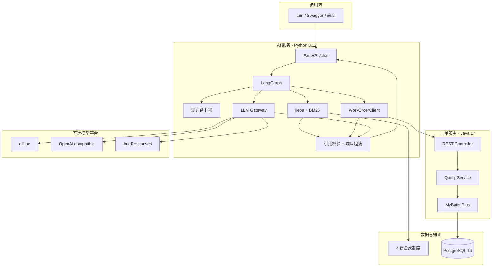
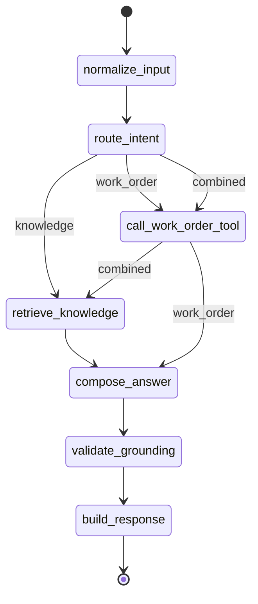
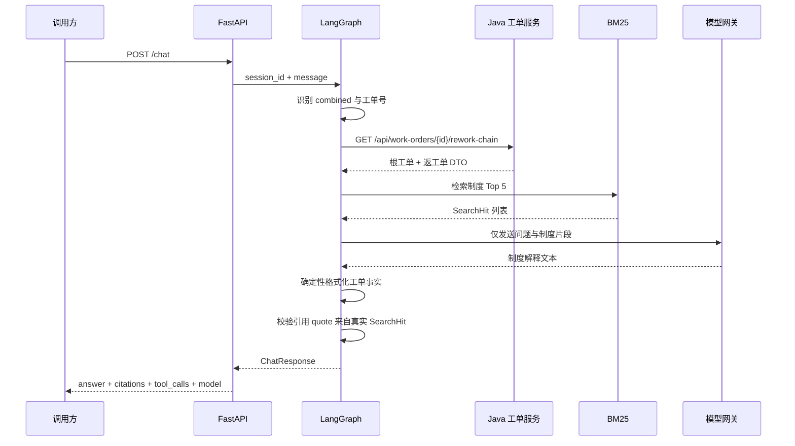

# 架构与可信边界

## 1. 目标与非目标

本项目演示如何把大模型能力接入已有企业 Java 系统，同时保留事实来源、制度依据、工具调用和降级状态的审计线索。

MVP 目标：

- 对合成工单执行详情、条件分页和返工链路查询。
- 对合成制度执行本地检索并返回可逐字校验的引用。
- 根据问题在知识检索、工单工具和组合链路之间显式路由。
- 默认无密钥运行，并可切换多个国内模型平台。
- 通过自动测试、冒烟测试和 30 题评测量化验证。

非目标：

- 不创建、修改、派发、完成或关闭工单。
- 不接入真实企业数据、权限中心或消息队列。
- 不训练、微调或评估基础模型能力。
- 不把离线模板结果包装成真实在线模型结果。

## 2. 组件与职责

| 组件 | 主要职责 | 明确不负责 |
| --- | --- | --- |
| Spring Boot 服务 | 工单领域查询、分页条件、返工链路、公共 DTO | 自然语言理解、制度解释 |
| PostgreSQL | 保存 50 条合成工单和稳定的返工关系 | 聊天记录、向量索引 |
| FastAPI | HTTP 契约、依赖装配、输入校验、健康检查 | 直接访问工单数据库 |
| LangGraph | 意图路由、工具编排、检索、回答组装和校验 | 自行声明引用或工具结果 |
| BM25 索引 | 中文分词、制度召回、稳定排序 | 生成工单事实 |
| 模型网关 | 平台协议适配、错误标准化、重试和降级 | 决定引用、修改业务数据 |
| 评测器 | 校验请求、召回、引用、工具和事实 | 主观评价文风 |

## 3. 运行时拓扑



Docker Compose 只向本机 IPv4 回环地址暴露 `8000` 和 `8080`，PostgreSQL 不映射宿主机端口。

## 4. 三条 Agent 路径



路由规则刻意保持可解释：

- 包含工单号且请求解释规则时走 `combined`。
- 包含工单号但只问事实时走 `work_order`。
- 没有工单号但要求列出或查询工单时走 `work_order`。
- 其余问题走 `knowledge`。

这不是通用 NLU，而是适合 MVP 的确定性基线。新增意图时应先扩充路由用例，再调整规则或引入分类模型。

## 5. 一次组合问答的时序



模型不会收到数据库连接信息，也不负责生成 `tool_calls` 或 `citations`。即使模型返回了类似引用编号的文本，结构化引用仍只来自检索结果。

## 6. 工单领域设计

### 6.1 数据模型

`work_order` 以业务工单号为主键，包含：

- 基础事实：标题、描述、项目、空间、来源、类型。
- 执行事实：状态、优先级、负责人、创建时间、截止时间、完成时间。
- 返工事实：`root_work_order_no` 和 `rework_reason`。

Flyway V1 创建结构，V2 使用 PostgreSQL `generate_series` 生成 50 条确定性数据，其中 5 条为返工单。所有名称均为虚构值。

### 6.2 返工链路

查询任意工单时：

1. 读取当前工单；不存在则返回稳定的 404 错误。
2. 当前工单有根工单号时取该值，否则以自身为根。
3. 查询“工单号等于根”或“根工单号等于根”的全部记录。
4. 按创建时间升序返回完整链路。

这一实现支持从根工单或任一返工单进入，避免只返回最后一张工单造成审计过程缺失。

### 6.3 查询边界

分页接口允许按状态、优先级、项目、负责人和创建时间过滤。过滤、排序和分页在 Java 服务内完成；AI 层只把自然语言中已识别的条件映射为公共查询参数。

## 7. RAG 与引用可信度

### 7.1 文档契约

每份 Markdown 制度必须包含：

```html
<!-- document_id: stable-document-id -->
```

加载器按二、三级标题划分段落，并生成稳定的 `chunk_id`。单段超过 500 字时按中文标点切分并保留 50 字重叠。

### 7.2 召回与排序

MVP 使用 jieba 分词与 BM25Plus。选择原因：

- 12 个制度段落不需要常驻向量数据库。
- 默认离线启动，结果可复现。
- 文档标识和原文 quote 天然适合审计。
- `PolicyIndex` 协议隔离检索实现，可增量引入 pgvector 混合召回。

### 7.3 引用校验

`Citation` 由 `SearchHit` 构造。返回前再次检查每个 `quote` 是否存在于本次检索命中的原文集合；不满足即移除。离线评测还会把 quote 与磁盘上的完整制度文本比对。

## 8. 模型网关

模型网关统一接收 `LLMRequest` 并返回 `LLMResult`。实现包括：

- `OfflineTemplateProvider`：直接输出检索片段，零外部依赖。
- `OpenAICompatibleProvider`：DeepSeek、百炼、智谱、Kimi、千帆和自定义网关。
- `ArkResponsesProvider`：适配方舟 `/responses` 的输入和输出结构。

重试仅覆盖超时、429 和 5xx 等可恢复错误；认证失败、无效模型和坏响应不盲目重试。允许降级时，返回离线结果并设置：

```json
{
  "provider": "offline",
  "fallback": true,
  "error_code": "PROVIDER_TIMEOUT"
}
```

API Key 使用 `SecretStr` 保存，不写日志、不进入响应，也不出现在测试夹具或仓库文档中。

## 9. 失败语义

| 场景 | 处理 |
| --- | --- |
| 工单不存在 | 工具记录 `error`，warning 为 `WORK_ORDER_NOT_FOUND` |
| Java 超时或连接失败 | warning 为 `WORK_ORDER_SERVICE_UNAVAILABLE` |
| Java 返回结构不符合 DTO | warning 为 `WORK_ORDER_BAD_RESPONSE` |
| 模型超时、429 或 5xx | 有界重试，之后按配置离线降级 |
| 模型认证或参数错误 | 不重试，按配置降级或返回 503 |
| 检索无结果 | 返回“知识库没有足够依据”，不伪造引用 |

## 10. 质量门禁

- Java：12 项测试，包含 Controller、Service、Flyway 合约和真实 PostgreSQL Testcontainers 集成测试。
- Python：路由、RAG、工具、LangGraph、API、模型适配器、重试降级和评测器测试。
- 端到端：Docker Compose 冒烟测试与 30 题离线评测。
- CI：Java、Python、镜像构建、Compose 验收，以及密钥、本地路径和客户标识扫描。

## 11. 可继续演进

1. 以 pgvector + BM25 做混合召回并增加重排器。
2. 用可配置意图分类器替换规则路由，同时保留回归集。
3. 接入企业统一认证，将工具权限下沉到 Java 服务。
4. 增加 OpenTelemetry trace，把检索、工具、模型和降级串成一次调用链。
5. 将工单工具扩展为受审批的写操作；默认继续保持只读。
6. 引入真实业务前先完成数据分级、脱敏、审计留存和模型供应商合规评审。
