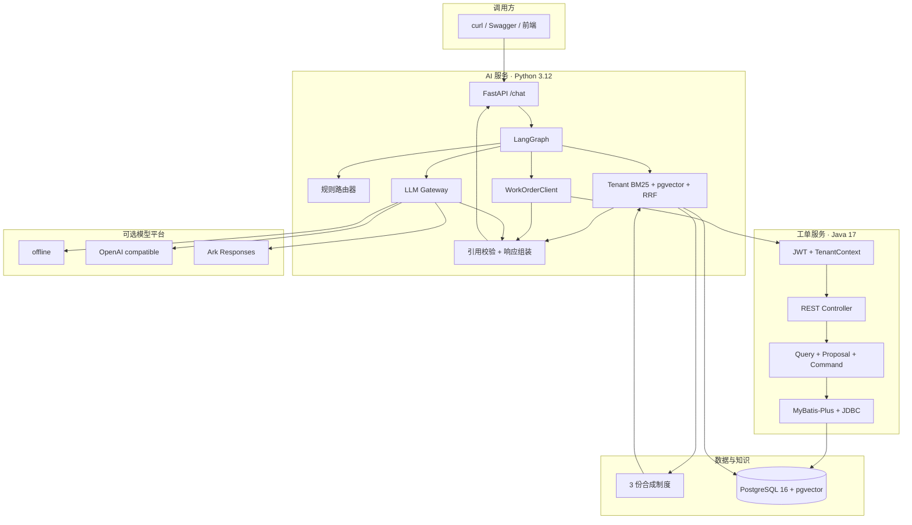
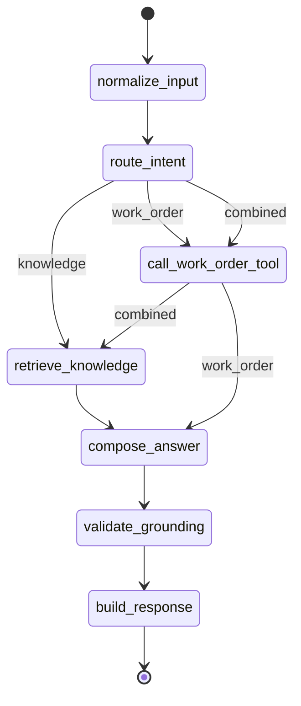
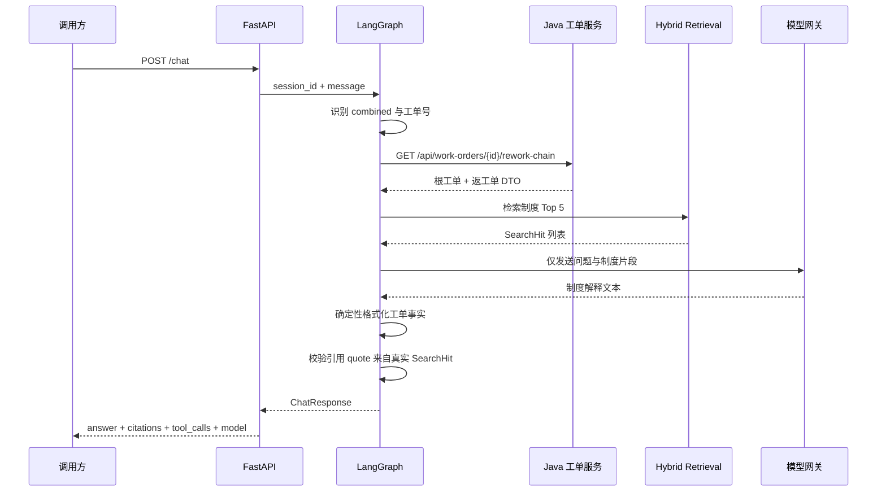

# 架构与可信边界

## 1. 目标与非目标

本项目演示如何把大模型能力接入已有企业 Java 系统，同时保留事实来源、制度依据、工具调用和降级状态的审计线索。

MVP 目标：

- 对合成工单执行详情、条件分页和返工链路查询。
- 以 JWT、数据库现行成员关系和项目范围共同限制每次工单访问。
- 对创建、派单、修改和状态变更先生成权威预览，再由有权的人确认。
- 在单个 PostgreSQL 事务内完成乐观锁写入、事件、Outbox 和幂等响应。
- 对合成制度执行本地检索并返回可逐字校验的引用。
- 根据问题在知识检索、工单工具和组合链路之间显式路由。
- 默认无密钥运行，并可切换多个国内模型平台。
- 通过自动测试、冒烟测试和 30 题评测量化验证。

非目标：

- 不接入真实企业数据、权限中心或消息队列。
- 不提供生产 Token 签发端点，也不在仓库保存 JWT 私钥。
- 不允许模型、Agent 或 `AI_SERVICE` 绕过人工确认直接写工单事实。
- 不训练、微调或评估基础模型能力。
- 不把离线模板结果包装成真实在线模型结果。

## 2. 组件与职责

| 组件 | 主要职责 | 明确不负责 |
| --- | --- | --- |
| Spring Boot 服务 | JWT 验证、租户/项目授权、查询、建议预览、状态机、命令事务 | Token 签发、自然语言理解、制度解释 |
| PostgreSQL | 合成工单、RLS、建议、Assignment、不可变事件、幂等、Outbox 与租户 pgvector 知识表 | 聊天记录 |
| FastAPI | JWT 租户验证、HTTP 契约、依赖装配、输入校验、检索健康与 worker 生命周期 | 直接访问工单事实表 |
| LangGraph | 意图路由、工具编排、检索、回答组装和校验 | 自行声明引用或工具结果 |
| Hybrid 索引 | 租户 BM25、pgvector、RRF、当前版本过滤与显式降级 | 生成工单事实 |
| 模型网关 | 平台协议适配、错误标准化、重试和降级 | 决定引用、修改业务数据 |
| 评测器 | 校验请求、召回、引用、工具和事实 | 主观评价文风 |

## 3. 运行时拓扑



Docker Compose 只向本机 IPv4 回环地址暴露 `8000` 和 `8080`，PostgreSQL 不映射宿主机端口。

认证 smoke 的 RSA 密钥、短期 Token、授权 SQL 和环境文件由 fixture 生成器临时写入 Git 忽略的 `.smoke/`；Compose override 把同一公钥只读挂载给 Python 与 Java。FastAPI 只从验证后的 Token 取得检索租户，请求体不能指定租户。管理员连接只用于建立合成身份和权限，验收计数改用受 RLS 约束的 `work_order_app`，并在事务内 `SET LOCAL app.tenant_id` 后按租户、工单号和建议 id 精确查询。

图中的 `TOOL -> SECURITY` 表示受保护的目标边界，不表示 Python 当前会签发 Token。当前 `WorkOrderClient` 不持有、签发或转发服务 JWT，因此本阶段的认证读写 smoke 直接调用 Java API；让 `/chat` 工单路径投入使用前，部署适配层必须显式实现 Token 传递/交换。该限制不能通过放开 Java 匿名访问来规避。

## 4. 三条 Agent 路径



路由规则刻意保持可解释：

- 包含工单号且请求解释规则时走 `combined`。
- 包含工单号但只问事实时走 `work_order`。
- 没有工单号但要求列出或查询工单时走 `work_order`。
- 其余问题走 `knowledge`。

这不是通用 NLU，而是适合 MVP 的确定性基线。新增意图时应先扩充路由用例，再调整规则或引入分类模型。

## 5. 一次组合问答的时序



模型不会收到数据库连接信息，也不负责生成 `tool_calls` 或 `citations`。即使模型返回了类似引用编号的文本，结构化引用仍只来自检索结果。

## 6. 工单领域设计

### 6.1 数据模型

`work_order` 以 UUID `id` 为内部主键，以 `(tenant_id, work_order_no)` 保证租户内业务号唯一，包含：

- 基础事实：标题、描述、项目、空间、来源、类型。
- 执行事实：状态、优先级、负责人、创建时间、截止时间、完成时间、接单时间和乐观锁 `version`。
- 返工事实：`root_work_order_no` 和 `rework_reason`。

Flyway V1/V2 建立旧版合成数据，V3-V5 将 50 条确定性工单迁移为两个合成租户各 25 条，并建立 `tenant`、`user_identity`、`tenant_membership`、`project_scope`、`action_proposal`、`work_order_assignment`、`work_order_event`、`idempotency_record`、`outbox_event` 与 `inbox_message`。所有名称均为虚构值。

### 6.2 返工链路

查询任意工单时：

1. 读取当前工单；不存在则返回稳定的 404 错误。
2. 当前工单有根工单号时取该值，否则以自身为根。
3. 查询“工单号等于根”或“根工单号等于根”的全部记录。
4. 按创建时间升序返回完整链路。

这一实现支持从根工单或任一返工单进入，避免只返回最后一张工单造成审计过程缺失。

### 6.3 查询边界

分页接口允许按状态、优先级、项目、负责人和创建时间过滤。每次查询先从 JWT 建立 `TenantContext`，再把 Token 角色/项目与数据库中当前 `tenant_membership`/`project_scope` 求交。 mapper 谓词仍显式包含租户和项目，PostgreSQL 事务同时执行 `set_config('app.tenant_id', ..., true)` 并由 FORCE RLS 再隔离一层。不存在、跨租户和跨项目都统一为 404，分页总数也只统计交集范围。

### 6.4 建议、人工决策与事实写入

操作建议保存数据库当前事实生成的 `before_snapshot`/`after_snapshot`、`expected_version`、风险和 15 分钟过期时间。客户端只能提交动作参数，不能提交租户、预览、风险、状态、版本、请求人、确认人或执行结果。建议的 `after_snapshot` 是权威预览，但在确认前不是 `work_order` 事实。

确认成功的一个事务依次保留/校验幂等记录、原子抢占建议为 `EXECUTING`、以租户和版本谓词写工单、维护 Assignment、追加 `work_order_event`、追加 `outbox_event`、保存稳定响应并标记 `EXECUTED`。任一步失败都回滚；可恢复失败在独立恢复事务中标记建议 `FAILED`。相同 `(tenant, operation, Idempotency-Key)` 与相同确认请求返回原响应，不再增加版本、事件或 Outbox；同键不同建议返回 `409 IDEMPOTENCY_KEY_CONFLICT`。

确认时重新读取当前成员角色和项目范围。`AI_SERVICE` 只要出现在当前有效角色中，即使同时具有 `DISPATCHER` 也不能确认或拒绝。并发确认由幂等唯一约束、建议原子抢占和 `version` 乐观锁共同收敛；过时预览返回 `409 WORK_ORDER_VERSION_CONFLICT` 及 `fresh_preview`，不自动覆盖事实。

**决策请求体是阶段 API 的严格契约：** `/confirm` 只接受 `{"decision":"CONFIRM"}`，`/reject` 只接受 `{"decision":"REJECT"}`。大小写、端点/decision 不匹配、缺字段或任意未知字段都返回 `422 INVALID_COMMAND`。

## 7. RAG 与引用可信度

### 7.1 文档契约

每份 Markdown 制度必须包含：

```html
<!-- document_id: stable-document-id -->
```

加载器按二、三级标题划分段落，并生成稳定的 `chunk_id`。单段超过 500 字时按中文标点切分并保留 50 字重叠。

### 7.2 版本、召回与排序

制度按租户、稳定文档键和内容哈希幂等摄取。分块嵌入成功后才原子激活新版本，检索只读最新 `ACTIVE` 文档。每次查询并行执行中文 BM25 Top 50 和 pgvector 余弦 Top 50（`hnsw.ef_search=100`），以分块 UUID 合并并使用 `1/(60+rank)` 的固定 RRF，最后稳定截取 Top 5。向量查询设相关距离上限以支持硬负例拒答；任一路失败时保留可用结果并返回 `HYBRID_RETRIEVAL_DEGRADED`。

FastAPI lifespan 幂等摄取合成制度并启动一个每批最多 20 个任务的租户 worker。首次本地模型下载不阻塞服务启动；`/health` 分别报告配置、模型加载、最近嵌入成功时间和当前检索模式。关闭时取消 worker，并尽力释放数据库、HTTP 与模型资源。

### 7.3 引用校验

`Citation` 由 `SearchHit` 构造。返回前再次检查每个 `quote` 是否存在于本次检索命中的原文集合；不满足即移除。离线评测还会把 quote 与磁盘上的完整制度文本比对。

## 8. 模型网关

模型网关统一接收 `LLMRequest` 并返回 `LLMResult`。实现包括：

- `OfflineTemplateProvider`：直接输出检索片段，零外部依赖。
- `OpenAICompatibleProvider`：DeepSeek、百炼、智谱、Kimi、千帆和自定义网关。
- `ArkResponsesProvider`：适配方舟 `/responses` 的输入和输出结构。

重试仅覆盖超时、429 和 5xx 等可恢复错误；认证失败、无效模型和坏响应不盲目重试。允许降级时，返回离线结果并设置：

```json
{
  "provider": "offline",
  "fallback": true,
  "error_code": "PROVIDER_TIMEOUT"
}
```

API Key 使用 `SecretStr` 保存，不写日志、不进入响应，也不出现在测试夹具或仓库文档中。

## 9. 失败语义

| 场景 | 处理 |
| --- | --- |
| Token 缺失、签名/issuer/audience/时间无效 | HTTP 401；不进入业务控制器 |
| 已认证但动作角色不满足，或 `AI_SERVICE` 尝试决策 | `403 ACTION_NOT_PERMITTED` |
| 跨租户、跨项目或不存在 | `404 WORK_ORDER_NOT_FOUND`，不披露资源存在性 |
| 版本在预览后变化 | `409 WORK_ORDER_VERSION_CONFLICT` + 新预览，不自动执行 |
| 同一幂等键绑定不同确认操作 | `409 IDEMPOTENCY_KEY_CONFLICT` |
| 状态机拒绝动作 | `409 INVALID_STATE_TRANSITION` |
| 建议已过期 | `410 ACTION_PROPOSAL_EXPIRED` |
| 命令字段、decision 或未知字段无效 | `422 INVALID_COMMAND` |
| 工单不存在 | 工具记录 `error`，warning 为 `WORK_ORDER_NOT_FOUND` |
| Java 超时或连接失败 | warning 为 `WORK_ORDER_SERVICE_UNAVAILABLE` |
| Java 返回结构不符合 DTO | warning 为 `WORK_ORDER_BAD_RESPONSE` |
| 模型超时、429 或 5xx | 有界重试，之后按配置离线降级 |
| 模型认证或参数错误 | 不重试，按配置降级或返回 503 |
| 检索无结果 | 返回“知识库没有足够依据”，不伪造引用 |

## 10. 质量门禁

- Java：领域、Controller、迁移、RLS、命令、幂等与并发测试；需要 Docker 的 Testcontainers 用例与纯 JVM 用例分开报告。
- Python：路由、RAG、工具、LangGraph、API、模型适配器、重试降级和评测器测试。
- 端到端：Docker Compose 冒烟测试使用真实 PostgreSQL 计数证明 replay 不重复事件/Outbox；缺少 Docker、Token、数据库成员 fixture 或服务时硬失败，不降级成静态通过。
- CI：Java、Python、镜像构建、Compose 验收，以及密钥、本地路径和客户标识扫描。

## 11. 可继续演进

1. 在 RRF 后增加可评测的重排器，同时保留 BM25/Hybrid 基线。
2. 用可配置意图分类器替换规则路由，同时保留回归集。
3. 为 Python 工单工具增加明确的调用方 Token 传递或服务间 Token 交换。
4. 增加 OpenTelemetry trace，把检索、工具、模型和降级串成一次调用链。
5. 将工单工具扩展为受审批的写操作；默认继续保持先建议、后确认。
6. 引入真实业务前先完成数据分级、脱敏、审计留存和模型供应商合规评审。

