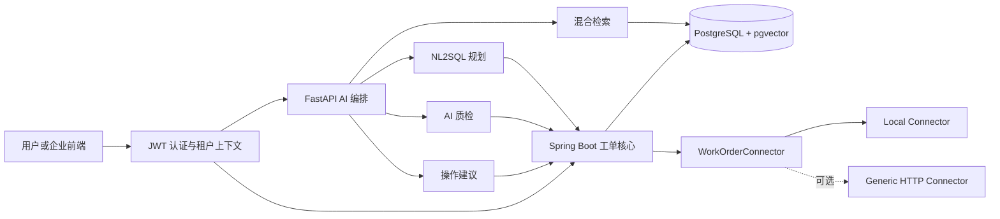

# 企业工单 AI 助手生产化演进设计

**状态：** 书面规格已于 2026-07-18 确认
**日期：** 2026-07-18
**数据边界：** 公开仓库仅包含合成租户、用户、制度和工单

## 1. 目标

把当前只读、单租户、50 条合成工单的 MVP 演进为可验证的企业工单 AI 助手，覆盖：

1. 工单创建、派单、修改和状态流转；
2. AI 质检、整改、复检和关闭闭环；
3. 受限且可审计的 NL2SQL；
4. OAuth2/OIDC、企业角色、项目范围和租户隔离；
5. pgvector 向量检索、BM25 和 RRF 混合召回；
6. 可替换的生产工单系统连接器。

## 2. 已确认的产品原则

- Java 服务是工单事实和高风险命令的唯一写入边界。
- Python AI 服务可写 AI 任务、模型调用和知识索引，不得直接写工单事实。
- 创建、派单、关键字段修改和状态流转必须先生成权威变更预览，再由有权限的用户确认。
- 标签、摘要、索引刷新和质检计算等低风险操作可按租户策略自动执行，但必须审计。
- `AI_SERVICE` 可以生成建议，不能确认自己生成的高风险建议。
- 默认 `local` 模式独立运行；`http` 模式通过通用连接器接入外部事实源。
- 私有企业代码库只用于只读领域研究。公开仓库不得包含其路径、包名、接口、主机、凭证、公司标识或专有规则。

## 3. 运行时架构

## 4. 数据所有权

| 数据 | 写入者 | 读取者 |
| --- | --- | --- |
| 租户、成员、项目范围 | Java | Java、Python（经授权接口） |
| 工单、派单、生命周期、整改案例 | Java | Java、Python（经授权接口） |
| 操作建议、幂等记录、Outbox/Inbox | Java | Java、审计系统 |
| 质检任务、结果、发现、模型调用 | Python AI 服务 | Python、Java（经回调） |
| 知识文档、分块、向量 | Python AI 服务 | Python |
| NL2SQL 审计 | Java | Java、租户审计员 |

数据库角色固定为：

- `work_order_app`：写工单领域，不写 AI 与知识表；
- `ai_app`：写 AI 与知识表，不写工单领域；
- `analytics_reader`：只读脱敏分析视图；
- Flyway 所有者角色只做迁移，不作为运行时账号。

## 5. 子项目与实施顺序

### 阶段 1：多租户写入基础

实现 JWT、角色与项目范围、RLS、操作建议确认、工单状态机、乐观锁、幂等、审计、Outbox 和连接器端口。详见 [多租户工单写入设计](2026-07-18-multitenant-work-order-write-design.md)。

### 阶段 2：pgvector 混合召回

引入知识持久化、嵌入任务、HNSW、BM25、RRF 和降级语义。详见 [pgvector 混合召回设计](2026-07-18-pgvector-hybrid-retrieval-design.md)。

### 阶段 3：AI 质检整改闭环

实现质检任务状态机、结构化发现、证据快照、模型调用审计、整改建议、整改单和复检轮次。详见 [AI 质检整改设计](2026-07-18-ai-quality-rectification-design.md)。

### 阶段 4：安全 NL2SQL

实现语义目录、双层 AST 校验、只读分析视图、RLS、成本与超时限制和查询审计。详见 [安全 NL2SQL 设计](2026-07-18-secure-nl2sql-design.md)。

### 阶段 5：生产连接与可观测性

实现通用 HTTP 连接器、外部事实源模式、对账、OpenTelemetry、指标和隐私扫描。详见 [生产连接器与可观测性设计](2026-07-18-production-connector-observability-design.md)。

## 6. 全局不变量

- 所有租户业务表必须包含 `tenant_id`，唯一约束必须包含租户维度。
- `tenant_id` 只能来自已验证身份或受信服务上下文，不能来自请求正文。
- 高风险操作没有 `EXECUTED` 状态的确认建议就不能改变工单事实。
- 每次工单事实变更必须同时产生不可变领域事件。
- 外部写入超时不得直接重试，必须先以幂等键查询外部结果。
- 模型失败或输出校验失败不得触发任何工单写入。
- NL2SQL 永远不能访问业务原表、系统目录或写数据库角色。
- 引用只能来自本次真实检索命中，不能由模型生成。
- 日志不得记录 Token、凭证、完整 Prompt、联系方式、原始图片 URL 或数据库连接串。

## 7. 总体验收门槛

| 指标 | 门槛 |
| --- | ---: |
| 跨租户数据泄漏 | 0 |
| 未确认高风险写入 | 0 |
| 非法状态流转拦截率 | 100% |
| 重试造成的重复写入 | 0 |
| 危险 SQL 拦截率 | 100% |
| 质检结果证据和版本可追溯率 | 100% |
| 混合召回 Recall@5 | 不低于 BM25 基线，扩展集至少 90% |

每个阶段必须在独立测试、跨服务契约测试和 Docker Compose 端到端测试通过后，才能成为下一阶段的依赖。
